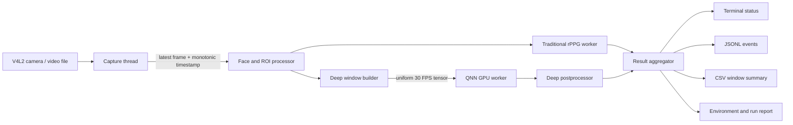

# Linux AArch64 QAIRT/QNN C++ rPPG 独立工程设计

日期：2026-07-21
状态：已确认设计，等待实施计划评审
目标平台：Linux AArch64、Qualcomm Adreno GPU、QAIRT/QNN、`libQnnGpu.so`

## 1. 目标与隔离边界

新建独立工程 `rPPG-qnn-cpp`，实现可在 Linux AArch64 台架运行的原生 C++ rPPG 程序。程序通过 V4L2 采集摄像头，独立运行传统 rPPG 与深度模型推理，在终端显示结果并保存 JSONL、CSV。

现有工程 `/Users/wangjie/Documents/keti/rPPG` 是只读参考，必须满足以下隔离规则：

- 不修改其源码、配置、文档、依赖、分支或 Git 历史。
- 不在其目录中生成构建文件、缓存、模型或结果。
- 不把 Python、Streamlit、PyTorch 或 rPPG-Toolbox 作为台架运行时依赖。
- 算法行为可通过阅读现有工程重新实现；若需要复制代码，必须先核对许可证并在新工程保留来源和许可证说明。
- 新工程使用独立 Git 仓库、CMake 工程、依赖锁定、测试、模型目录和发布包。

## 2. 范围

### 第一阶段

- Linux AArch64 原生 C++17 程序。
- V4L2 摄像头输入和视频文件输入。
- 单调时钟记录真实帧时间戳。
- 人脸检测、ROI 稳定和 ROI RGB 时序提取。
- 至少一个传统算法基线；首选 GREEN，随后加入 POS、CHROM。
- EfficientPhys 的模型导出、QAIRT 转换和 QNN GPU 推理。
- 传统与深度两条计算链解耦运行。
- 终端状态、JSONL 明细、CSV 窗口汇总和环境报告。
- 运行前预检、健康状态和明确错误码。

### 后续阶段

- 依次验证 TSCAN、DeepPhys、PhysNet。
- 增加蓝牙手表输入适配器，但不改变核心流水线接口。
- 根据台架能力评估 HTP/NPU；本设计的首要后端仍是 Adreno GPU。

### 非目标

- 不在台架上训练或微调模型。
- 不提供 Streamlit 网页界面。
- 不把结果用于医疗诊断或车辆安全闭环。
- 不保证未经验证的模型一定能被 QNN GPU 完整接管；模型必须通过转换和算子兼容性验收。

## 3. 技术路线选择

采用原生 QAIRT/QNN C++ API，不采用 Python 进程，也不把 ONNX Runtime QNN Execution Provider 作为首选运行时。

原因：

- 台架已经提供 `libQnnGpu.so`，原生 QNN 与实际供应商运行环境边界最清晰。
- QAIRT/QNN 能显式选择 GPU 后端并提供后端错误信息，便于证明推理实际运行在 Adreno GPU。
- 原生接口减少 Python、PyTorch、ABI 和第三方运行时版本组合。
- ONNX Runtime 的 QNN EP 可作为以后兼容层研究，但当前公开文档重点覆盖 Android 和 Windows；本项目不以它作为 Linux AArch64 首版交付前提。

## 4. 总体架构



所有跨线程队列都有固定容量。采集到 ROI 的队列只保留最新帧；深度推理队列只保留最新完整窗口。消费者落后时替换旧任务而不是阻塞采集线程。

## 5. 模块边界

### `capture`

职责：

- 枚举和打开 `/dev/video*`。
- 配置宽度、高度、像素格式和目标 FPS。
- 将驱动时间戳转换或映射到进程单调时间轴。
- 输出 `FramePacket`：帧编号、时间戳、图像和采集诊断。
- 视频文件输入使用同一 `FrameSource` 接口，便于可重复测试。

不负责：人脸检测、心率算法和磁盘报告。

### `vision`

职责：

- 检测人脸并生成统一 `FaceBox`。
- 根据配置选择面颊、额头或整脸信号 ROI。
- 在检测间隔内跟踪并稳定 ROI。
- 输出 ROI 图像、检测置信度、丢脸状态和运动指标。

首版优先使用 OpenCV C++ 中可离线分发的检测方式。检测模型或级联文件作为版本化资产清单管理，不硬编码绝对路径。

### `traditional`

职责：

- 从 ROI 计算每帧平均 RGB。
- 按真实时间戳维护窗口并重采样。
- 实现 GREEN，以及后续 POS、CHROM。
- 滤波、频谱估计、BPM、置信度和质量门控。
- 发布传统脉搏波与窗口结果。

### `deep`

职责：

- 按模型注册信息维护原始 ROI 帧窗口。
- 使用真实时间戳重采样至模型约定的 30 FPS。
- 严格复现 RGB、缩放、标准化或差分归一化、布局和窗口长度。
- 调用统一 `IDeepRuntime` 接口执行推理。
- 将模型输出波形转换为 BPM、置信度和门控状态。

模型注册信息包含模型名、模型文件、输入名称、输出名称、形状、布局、窗口长度、FPS、预处理版本、checkpoint 哈希和转换工具版本。

### `qnn_runtime`

职责：

- 动态加载 QAIRT/QNN 接口和 `libQnnGpu.so`。
- 校验 API 版本与所需符号。
- 创建日志、后端、设备、上下文和图。
- 加载经验证的 DLC 或 QNN 上下文产物；具体格式由安装 SDK 支持的官方工具链决定，并记录在模型清单。
- 分配和复用输入输出张量，避免每个窗口重复分配。
- 串行执行单模型推理并记录纯推理耗时。
- 释放资源时遵守与创建相反的顺序。

GPU 初始化或执行失败时不得静默切换到 CPU。只有显式指定 `--backend cpu` 的诊断运行才允许加载 QNN CPU 后端，并在所有报告中标记实际后端。

### `output`

职责：

- 以固定频率刷新终端，不进入计算关键路径。
- 追加写 JSONL 事件并按批次刷新。
- 写 CSV 窗口摘要。
- 在启动时生成环境报告，在结束时补充统计摘要。

## 6. 核心接口

接口使用值对象和所有权明确的智能指针，不向业务层泄露 QNN 原始句柄。

```text
FrameSource::open(config)
FrameSource::read() -> FramePacket
FrameSource::close()

RoiProcessor::process(FramePacket) -> RoiPacket

TraditionalPredictor::add_sample(RgbSample)
TraditionalPredictor::latest_result() -> optional<HeartRateResult>

DeepWindowBuilder::add_frame(RoiPacket)
DeepWindowBuilder::take_latest_ready() -> optional<DeepInput>

IDeepRuntime::load(ModelManifest)
IDeepRuntime::infer(DeepInput) -> DeepOutput
IDeepRuntime::close()

ResultSink::publish(ResultEvent)
ResultSink::close()
```

`HeartRateResult` 统一包含：算法或模型名、窗口起止时间、BPM、置信度、有效状态、无效原因、源 FPS、样本数、最大帧间隔、计算耗时和可选归一化波形。

## 7. 模型转换与验证链

转换在 x86_64 Linux 开发机或 Qualcomm 官方支持的转换主机执行，台架不承担 PyTorch 模型转换。

流程：

1. 从预训练 `.pth` 加载固定模型和权重，仅用于导出。
2. 使用固定形状导出 ONNX，并记录 PyTorch、ONNX、opset、输入输出名称和 checkpoint SHA256。
3. 使用 ONNX checker 和固定样本运行 ONNX 数值对齐。
4. 使用 `qairt-converter --dry_run` 检查不支持的算子和属性。
5. 生成适合 QNN GPU 的浮点模型产物。首版优先 FP16；只有精度和算子验证通过后才考虑其他精度。
6. 使用 `qnn-net-run` 或 SDK 对应官方样例在台架加载 `libQnnGpu.so` 做冒烟测试。
7. 使用同一组冻结输入比较 PyTorch、ONNX、QNN GPU 的输出波形、BPM 和有效状态。
8. 生成不可变模型清单并随发布包交付；大模型文件不提交 Git。

EfficientPhys 是首个迁移候选，但不是无条件接受。若 `dry_run` 或数值对齐失败，则保存失败报告并按 TSCAN、DeepPhys、PhysNet 的顺序验证下一个候选，不通过改写含义不明的模型算子来强行交付。

## 8. 数据流和调度

- 采集线程只负责读帧和入队，禁止运行深度推理和磁盘编码。
- ROI 处理产生同一份 `RoiPacket`，供两条心率链读取，避免重复检测人脸。
- 传统算法每帧更新 RGB 时序，并按其窗口步长产生结果。
- 深度窗口构建器积累真实时间戳帧，达到时长后重采样为模型固定输入。
- QNN worker 默认每秒最多接收一个新窗口；推理未完成时，新完整窗口替换尚未开始的旧窗口。
- 结果聚合器按窗口时间对齐传统和深度结果，但不等待两者同时完成。
- 输出线程读取缓存快照，绘制终端和写文件不会触发重新推理。

## 9. 配置和目录

计划目录：

```text
rPPG-qnn-cpp/
  CMakeLists.txt
  cmake/
  include/rppg_qnn/
  src/
    app/
    capture/
    vision/
    traditional/
    deep/
    qnn/
    output/
  tests/
  tools/model_export/
  configs/
  models/                 # Git 忽略，只放本地模型
  third_party/            # 只保存许可证允许且固定版本的依赖
  docs/
  packaging/
```

构建时通过 `QAIRT_SDK_ROOT` 指向台架匹配的 SDK。构建系统根据目标三元组选择 AArch64 头文件和库，不搜索或链接宿主机 x86_64 QNN 库。运行包使用相对目录和启动脚本设置受控的动态库搜索路径，不写入全局系统目录。

## 10. 命令行契约

首版提供单一可执行文件 `rppg_qnn_live`：

```text
rppg_qnn_live \
  --camera /dev/video0 \
  --width 1280 --height 720 --fps 30 \
  --traditional green \
  --deep-model models/efficientphys/model_manifest.json \
  --backend gpu \
  --output outputs/session_name
```

还支持 `--video` 替代 `--camera`，用于离线回放和跨平台数值验证。`--camera` 与 `--video` 互斥。配置错误在打开摄像头和加载 GPU 前失败。

## 11. 输出契约

### JSONL

每行是独立事件，包含 `schema_version`。事件类型至少包括：

- `session_start`
- `preflight_result`
- `frame_health`
- `heart_rate_result`
- `runtime_error`
- `session_end`

### CSV

一行对应一个心率窗口，字段至少包括：

- `method`
- `window_start_sec`
- `window_end_sec`
- `bpm`
- `confidence`
- `is_valid`
- `invalid_reason`
- `source_fps`
- `source_frame_count`
- `max_frame_gap_sec`
- `inference_ms`
- `backend`
- `model_sha256`

### 环境报告

记录 Git 提交、构建类型、编译器、目标架构、内核、摄像头格式、QAIRT/QNN API 版本、加载的后端库路径、OpenCL 库路径、模型清单哈希和完整参数。

## 12. 错误处理

使用稳定错误码和可读消息：

- `CONFIG_INVALID`
- `CAMERA_OPEN_FAILED`
- `CAMERA_FORMAT_UNSUPPORTED`
- `LOW_CAPTURE_FPS`
- `FACE_NOT_FOUND`
- `QNN_LIBRARY_NOT_FOUND`
- `QNN_API_INCOMPATIBLE`
- `QNN_GPU_INIT_FAILED`
- `MODEL_MANIFEST_INVALID`
- `MODEL_LOAD_FAILED`
- `INFERENCE_FAILED`
- `OUTPUT_WRITE_FAILED`

摄像头短暂丢帧和无人脸属于可恢复状态，只停止发布心率；QNN 初始化、模型加载、输出目录不可写属于启动失败。运行中 QNN 连续失败达到配置阈值后关闭深度链并返回非零退出码，但传统链可在报告完整记录后安全结束。

## 13. 测试策略

### 主机单元测试

- 时间戳单调性和 30 FPS 重采样。
- 环形缓冲区和 latest-only 队列覆盖行为。
- GREEN/POS/CHROM 的合成信号 BPM。
- EfficientPhys 预处理的形状、布局和数值基准。
- FFT 后处理、置信度和门控。
- JSONL、CSV schema 和错误码。
- 模型清单、哈希和路径验证。

### 主机集成测试

- 固定视频经过完整 C++ 传统链。
- 冻结输入经过假 QNN runtime，验证调度不会阻塞采集。
- ASan/UBSan 构建运行核心测试。

### 台架测试

- `qnn-net-run` GPU 冒烟测试。
- C++ 程序确认加载 `libQnnGpu.so` 和 `libOpenCL.so`。
- V4L2 连续运行 30 分钟，无死锁、无持续内存增长。
- 记录采集 FPS、丢帧率、QNN 推理 P50/P95、CPU、内存和有效窗口率。
- 同一冻结视频与开发机 Python 参考输出对齐。
- 拔除模型、错误库路径、摄像头占用和低 FPS 故障注入。

## 14. 验收标准

- 原工程 `rPPG` 的 Git 状态和提交保持不变。
- 新工程能交叉编译或在受支持的 AArch64 Linux 环境原生编译。
- 发布包不需要 Python、PyTorch、Streamlit 或 rPPG-Toolbox。
- V4L2 采集不会等待 QNN 推理。
- 传统和深度结果同时进入终端、JSONL 和 CSV。
- 报告能证明实际后端是 GPU，且不存在静默 CPU 回退。
- EfficientPhys 或替代候选通过 PyTorch、ONNX、QNN GPU 三端数值对齐。
- README 能让未参与开发的操作者完成环境预检、安装、运行、健康检查和故障诊断。
- 所有不含硬件依赖的自动化测试通过；台架验收结果单独归档。

## 15. 发布与回滚

发布包按目标架构和 QAIRT 主版本命名，包含可执行文件、配置、模型清单、模型产物、所需且允许再分发的运行库、许可证、启动脚本和 README。Qualcomm SDK 库是否可再分发必须按台架供应协议确认；若不允许，发布包只校验并使用台架预装库。

部署先在独立目录解压，不覆盖旧版本。`current` 符号链接只在预检和短时冒烟测试通过后切换；回滚时将链接切回上一版本。运行数据放在版本目录之外，回滚不删除实验记录。

## 16. 官方依据

- Qualcomm QAIRT Linux 设置说明：支持 x86 Linux 和 ARM Linux 的特定 Ubuntu/Python 组合；ARM Linux 目标侧模型转换仅确认 ONNX；GPU 后端依赖 OpenCL 2.0，并要求运行时可找到 `libOpenCL.so`。
  https://docs.qualcomm.com/bundle/publicresource/topics/80-63442-10/linux_setup.html?product=1601111740009302
- Qualcomm QAIRT Converter：`qairt-converter` 可转换 ONNX、TensorFlow、TFLite 和 PyTorch，支持 `--dry_run` 检查模型，并说明 GPU/CPU 浮点运行相关转换方式。
  https://docs.qualcomm.com/bundle/publicresource/topics/80-63442-10/qairt_converter.html?product=1601111740010412
- Qualcomm QNN Backend API：后端需要先创建，API 提供版本、能力、创建和释放接口，并定义不支持平台等错误。
  https://docs.qualcomm.com/bundle/publicresource/topics/80-63442-10/api-rst_file_include_QNN_QnnBackend_h.html
- Qualcomm Linux 软件架构：Adreno 可使用优化驱动栈，开发接口包括 OpenGL ES、Vulkan 和 OpenCL；AI/ML 子系统可通过 Qualcomm 运行时访问加速器。
  https://docs.qualcomm.com/bundle/publicresource/topics/80-80022-252/qualcomm-linux-sw-overview.html
